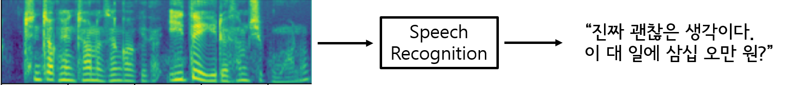
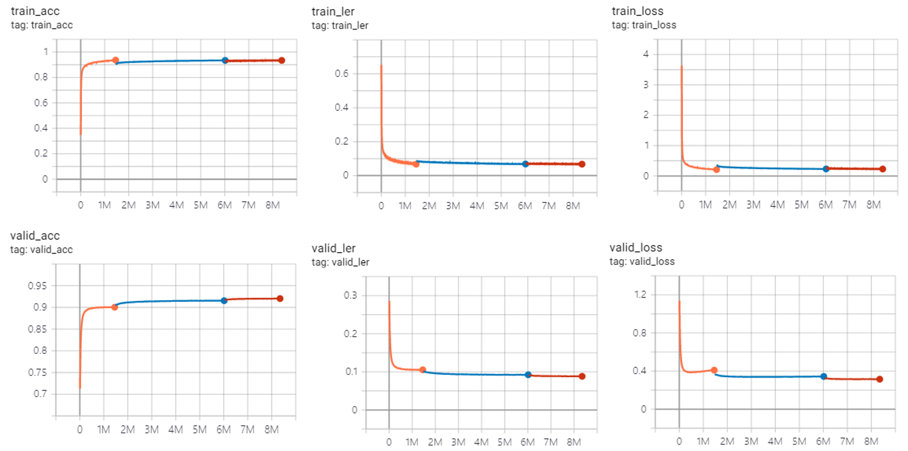
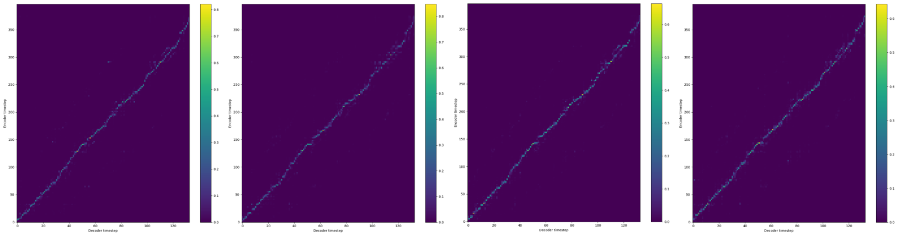

# tf2-speech-recognition-transformer
Tensorflow 2 Speech Recognition Code (Transformer)

## Developers
* Younglo Lee (yllee@ispl.korea.ac.kr)

## Contents
  * [Contents](#contents)
  * [Speech Recognition](#speechrecognition)
  * [Features](#features)
  * [Prerequisites](#prerequisites)
  * [Examples](#examples)
  * [References](#references)
    
## Speech Recognition
- Tensorflow 2 implementation for korean speech recognition.
- Dataset can be downloaded in http://www.aihub.or.kr/aidata/105/download and https://github.com/clovaai/ClovaCall

## Features
- Transformer speech recognition model
- Stacked frames with overlap (a.k.a. Lower Frame Rate, refer to https://arxiv.org/abs/2002.02562)
- Korean syllable tokenization

## Prerequisites
- Python 3.x
- Tensorflow 2.2.0
- Librosa 0.6.3
- etc.

## Examples
- Tensorboard examples (curriculum learning with increasing data length from 500 -> 1000 -> all)

- Attention weight examples (4 heads)

## References and Resources
- https://github.com/Rayhane-mamah/Tacotron-2
- https://github.com/clovaai/ClovaCall
- https://github.com/sooftware/KoSpeech (for train/test split csv)
- https://www.tensorflow.org/tutorials/text/transformer
